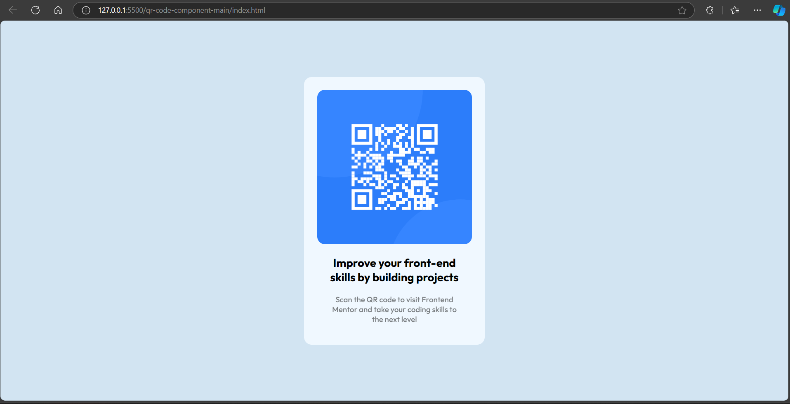

# QR-code component solution

This is a solution to the [QR code component challenge on Frontend Mentor](https://www.frontendmentor.io/challenges/qr-code-component-iux_sIO_H). Frontend Mentor challenges help you improve your coding skills by building realistic projects. 

## Table of contents

- [Overview](#overview)
  - [Screenshot](#screenshot)
  - [Links](#links)
- [My process](#my-process)
  - [Built with](#built-with)
  - [What I learned](#what-i-learned)
  - [Continued development](#continued-development)
  - [Useful resources](#useful-resources)
- [Author](#author)
- [Acknowledgments](#acknowledgments)

## Overview

Developing a QR-code component project using HTML and CSS.

### Screenshot

### Links

- Solution URL: [Solution URL](https://github.com/abdulkadir023/Qr-Code-Component)
- Live Site URL: [Live site URL](https://your-live-site-url.com)

## My process

- I developed the project using HTML & CSS. I used VS Code as my code editor

### Built with

- Semantic HTML5 markup
- CSS custom properties
- Flexbox
- Mobile-first workflow

### What I learned

As i was working on the project i realised that in order to grasp the concepts you need to build something to practice what you have learned from the tutorials. That's why these kind of projects are good to learn more and explore.

### Continued development

- Media queries 

### Useful resources

- [resource 1](https://betterstack.com/community/questions/) - This helped me with git commands and i think i'll be using it in the future for reference purposes.
- [resource 2](https://www.w3schools.com/) - This website realy helped me finally understand media queries. I'd recommend it to anyone still learning this concept.

## Author

- Website - [Abdulkadir](https://github.com/abdulkadir023/)
- Frontend Mentor - [@abdulkadir023](https://www.frontendmentor.io/profile/@abdulkadir023)

## Acknowledgments

I would like to thank Frontend Mentor for this challenge and making it available for free for people like myself to practice what i have learned from tutorials.

